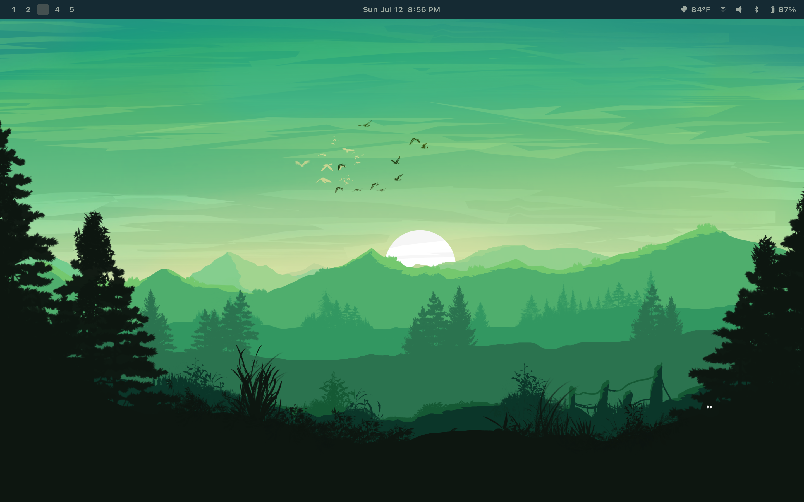

  

<em>There's a garden outside Apple's</em>

<h1 align="center">Orchard</h1>

My Arch configuration for the [2026 Dell XPS 14](https://www.dell.com/en-us/shop/dell-laptops/new-xps-14-laptop-2026/spd/xps-da14260-laptop) and M1/M2 Silicon Macs. Check out the [orchard manual](https://orchard-manual.netlify.app/).

