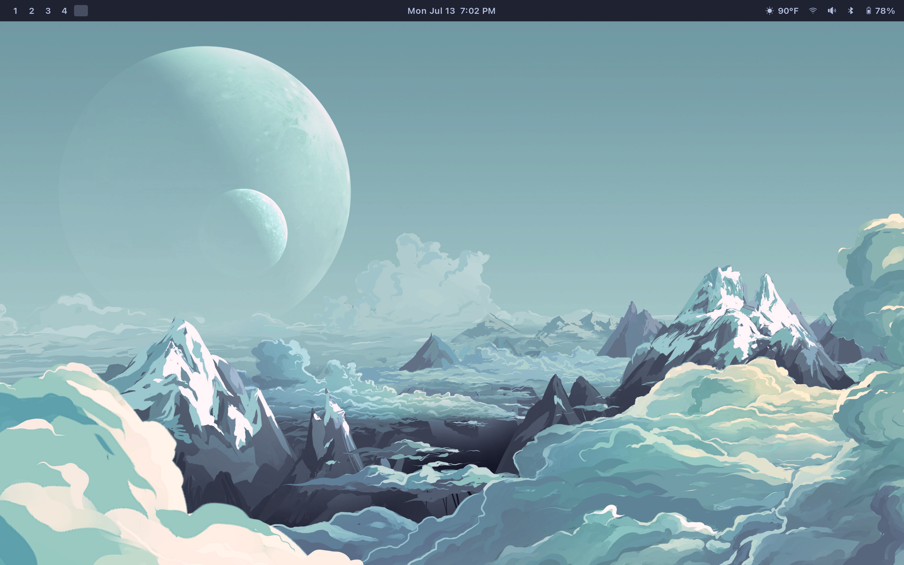
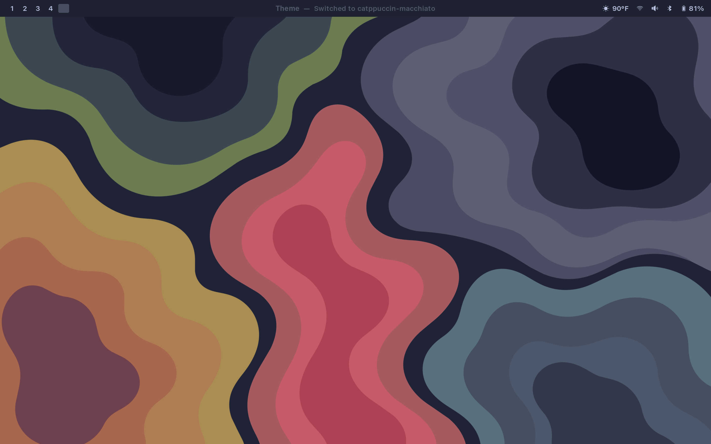
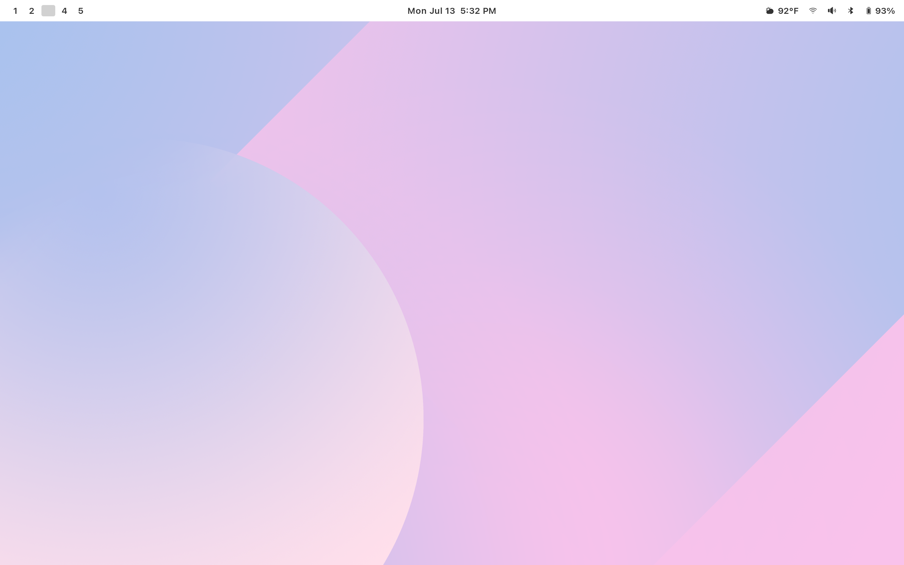

  

<em>There's a garden outside Apple's</em>

<h1 align="center">Orchard</h1>

My Arch configuration for the [2026 Dell XPS 14](https://www.dell.com/en-us/shop/dell-laptops/new-xps-14-laptop-2026/spd/xps-da14260-laptop) and M1/M2 Silicon Macs.

Check out the [orchard manual](https://orchard-manual.netlify.app/).

> [!NOTE]
> That manual is 95% AI generated and some things aren't accurate.

<!-- screenshots -->
<table>
  <tr>
    <td width="50%"></td>
    <td width="50%"></td>
  </tr>
  <tr>
    <td align="center"><code>catppuccin-frappe</code></td>
    <td align="center"><code>catppuccin-macchiato</code></td>
  </tr>
  <tr>
    <td width="50%"></td>
    <td width="50%"></td>
  </tr>
  <tr>
    <td align="center"><code>everforest</code></td>
    <td align="center"><code>rose-pine-dawn</code></td>
  </tr>
</table>
<!-- /screenshots -->

Generated by <code>tools/update-readme-screenshots</code> — drop a screenshot in <code>screenshots/</code>, named for its theme, and run it.
